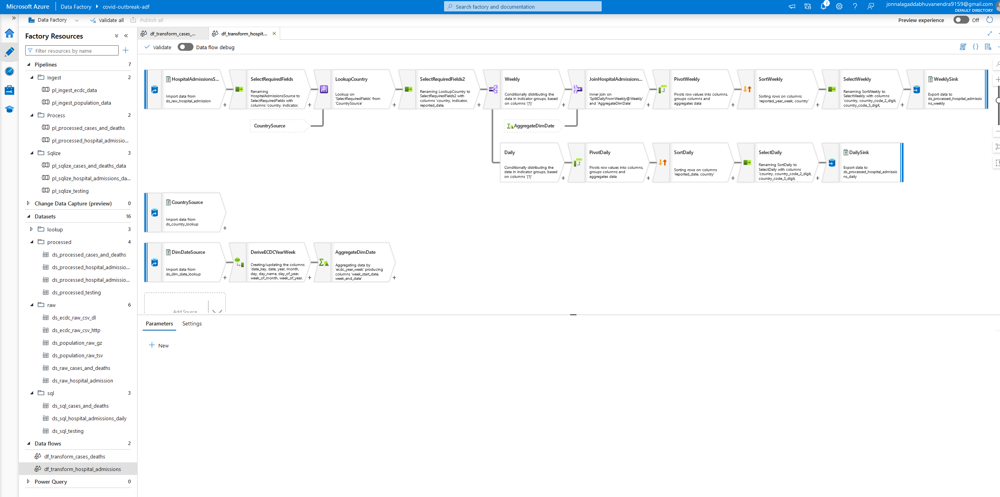

# covid19-outbreak-analysis

Data Source:
``https://www.ecdc.europa.eu/en/covid-19/data``
* Created a data ingestion pipeline to get/copy necessary data (cases, deaths, hospital admissions, testing) from this above website using http connector into the azure data lake everyday midnight at 12am.
* Built multiple data transformation pipelines using Azure Data Flow, HDInsights pipelines using Hive and Azure Databricks pipelines using PySqark and stored the data in Azure SQL database for downstream analytics.
* Published the data to Microsoft PowerBI and built auto refreshing dynamic dashboards.
* Created alerts, monitored the data flow using Azure Monitor and Log Analytics, and built error monitoring workbooks using Kusto Query Language (KQL) to analyze trigger/pipeline runs, memory/compute usage by each resource and so on.
* Utilized Azure DevOps/Git to maintain continuous integration, continuous delivery and continous monitoring/improvements throughout the project.
* Automated both the data ETL and CI/CD integration to dev (build), test (validation) and prod (empty) environments using Npm package build pipeline, pre/post deployment scripts in release pipelines and automatically generating ARM template for continuous deployment in test/prod.

#### Tech Stack used:

```
1. Azure DevOps (CI/CD)
2. Azure Data Factory
3. Azure Data Lake Gen 2
4. Azure Data Flows
5. HDInsight (Hive)
6. Azure Databricks (PySpark, Spark SQL)
7. Azure SQL database (T-SQL - Transact-SQL)
8. Azure Monitor/Log Analytics (KQL - Kusto Query Language)
9. Microsoft PowerBI
```

One of the transformation pipeline:
)


